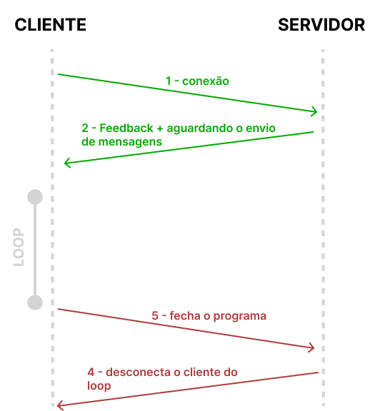

# Projeto de Redes I

## Sobre o Projeto

Foi desenvolvido um aplicativo de mensagens, onde o usuário pode criar uma sala de bate papo, enviar a porta para os múltiplos clientes, e conversarem através de um chat. 

## Bibliotecas

- CustomTkiner
- Socket
- Thread

## Protocolo

1. O cliente se conecta ao Host e Porta, como é pedido no aplicativo

2. Retorna um feedback de conexão

    1. Caso seja conexão positiva:

    Retorna o feedback positivo e abre uma outra aba, sendo ela o chat.

    2. Em caso negativo:

    Retorna apenas uma mensagem de feedback de conexão:

3. O cliente pode então digitar e enviar ela para os clientes que estam conectados à mesma porta.
